# Secure and Fast Static Website Deployment on AWS using Pulumi

This is a repository to set up a secure and fast static website deployment using pulumi.

## Table of content

- [Overview](#overview)
- [Objectives](#objectives)
- [Technologies](#technologies)
- [Project Architecture](#project-architecture)
- [Project Structure](#project-structure)
- [Prerequisites](#prerequisites)
- [Pulumi Installation](#pulumi-installation)
- [Setup Project Template](#setup-project-template)
- [Deploy the Static Website](#deploy-the-static-website)
- [Secure the website deployment](secure-the-website-deployment)
- [Setup a Custom Doman](#setup-a-custom-domain)
- [Best Practices](#best-practices)

    
## Overview

This project uses Pulumi as an IAC tool to set up a secure and fast static website deployment. Pulumi is a unique IAC tool that lets you define your infrastructure using your favorite programming language. With Pulumi, we'll set up the infrastructure (S3 bucket, CloudFront, and Route 53) on AWS and securely deploy the static website files to this infrastructure using Python.

## Technologies

* **Pulumi**: An Infrastructure as Code (IaC) tool that provisions and manages cloud resources using Python.
    
* **Python**: A programming language that provides modules to interact with Pulumi and AWS resources.
    
* **S3 Bucket**: An object storage service that stores static website files and assets, serving as the origin for CloudFront.
    
* **CloudFront**: A Content Delivery Network (CDN) that caches and securely delivers website content globally with low latency. These contents are cached at edge locations closer to your users.
    
* **Route 53**: A service that manages DNS records, enabling the use of a custom domain for the website.
    

## Architecture
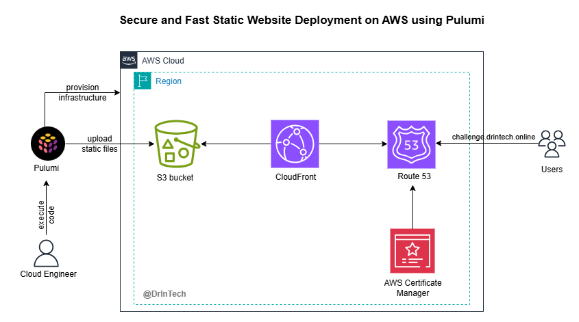

## Project Structure
```
📁 website/
├── 📁 .assets/             # 📸 Images used for documentation
├── 📁 react_webiste/       # ⚛️ Source code for your React static site
├── 📁 venv/                # 🐍 Python virtual environment (local to the project)
├── 📁 www/                 # 🌐 Compiled/static website files to be uploaded to S3
├── 📄 __main__.py          # 🚀 Pulumi program entry point (infrastructure code)
├── 📄 Pulumi.yaml          # 📦 Project-level configuration (name, runtime)
├── 📄 Pulumi.dev.yaml      # 🛠️ Stack-specific config (e.g. region, settings)
├── 📄 README.md            # 📖 Project overview and instructions
├── 📄 requirements.txt     # 📋 Python dependencies
└── 📄 .gitignore           # 🚫 Files and folders to ignore in Git
```
## Prerequisites

To get started, make sure you have the following:

* Python3, pip, and python3-venv installed
    
* A basic understanding of Python
    
* AWS CLI installed and configured
    

## Pulumi Installation

You will now install Pulumi. If you're not using Linux, check the documentation for the installation command specific to your operating system.

```sh
curl -fsSL https://get.pulumi.com | sh
```

After installation, you need to restart the shell. You can do this by either closing and reopening your terminal or refreshing the shell configuration with a command.

```sh
source ~/.bashrc
```

Confirm Pulumi installation.

```sh
pulumi version
```

## Setup Project Template

To easily start building the infrastructure, Pulumi provides a static website template. This template includes basic configurations to deploy a simple static website using S3 and CloudFront.

1. Create an empty directory and set up the static website template.
    

```sh
mkdir website && cd website
pulumi new static-website-aws-python
```

If you're using `pulumi new` for the first time, you'll need to sign in through your browser to Pulumi Cloud to authenticate your CLI. This is important because Pulumi automatically manages the state file remotely for you.
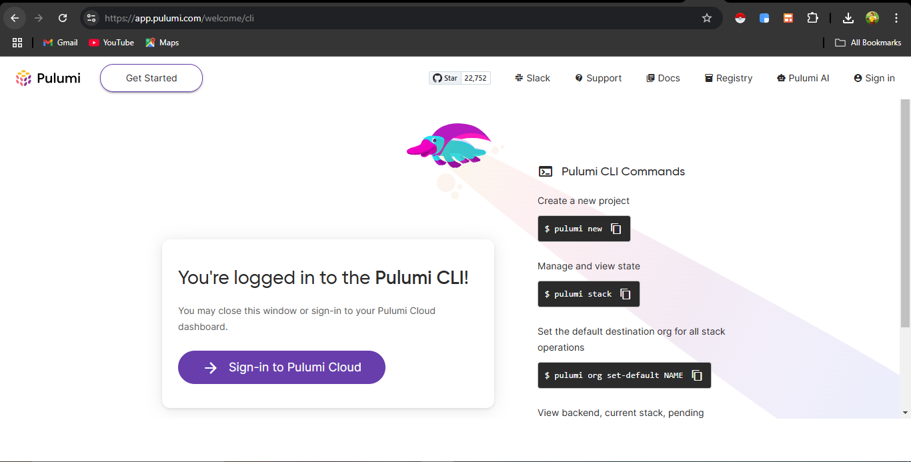

2. After authentication, configure the project and stack for deploying the website.
    

* You can leave the project name, description, and stack name as default.
    
* Choose pip as the toolchain for installing dependencies.
    
* Set `us-east-1` as the region to deploy our AWS resources, such as S3 buckets.
    
* the index, error document and website path are set to default. After completing the configuration, pulumi proceeds to install the dependencies defined in the `requirements.txt`. 

If you run into errors due to python env, ensure the python3-venv installed matches the version of the python3 installed on your machine. Then run `pulumi install` to try again.
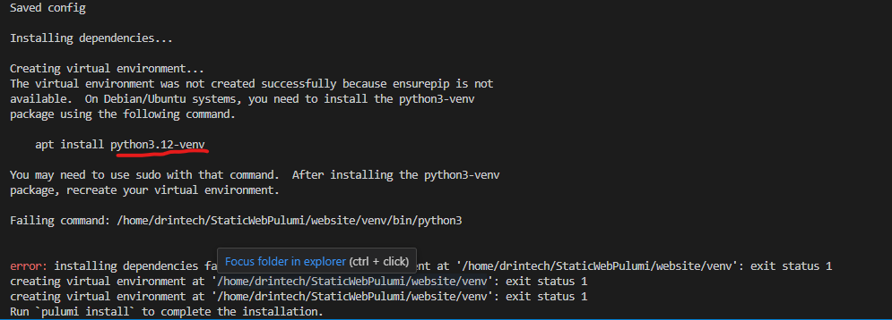

**Note**: The Pulumi Python dependencies plugin can take a while to install.
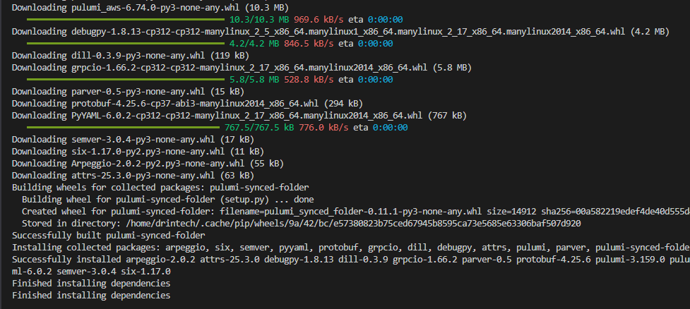  

Pulumi manages your infrastructure as a project and stack. Projects represent your entire infrastructure definition. They include metadata, runtime, and some configuration to manage and execute your infrastructure code. A project is defined in the `pulumi.yaml` file. A stack is an instance of the project with its own configuration and state. Stacks include environment-specific configurations that allow us to deploy the infrastructure to different environments such as dev, staging, and prod. A stack is defined in the `pulumi.dev.yaml`.

After setting up the project and stack, Pulumi generates the following files for you.

* `pulumi.yaml`: This represents our project. It includes metadata, runtime and configs to manage our infrastructure code.
    

```yml
name: website
description: A Python program to deploy a static website on AWS
runtime:
  name: python
  options:
    toolchain: pip
    virtualenv: venv
config:
  pulumi:tags:
    value:
      pulumi:template: static-website-aws-python
```

* `pulumi.dev.yaml`: This file represents your stack for the development environment. It includes environment-specific configurations such as the AWS region, the path to static files, and HTML documents.
    

```yml
config:
  aws:region: us-east-1
  website:indexDocument: index.html
  website:errorDocument: error.html
  website:path: ./www
```

* `__main__.py`: This is the main file that contains the code defining our infrastructure. It specifies the resources to be deployed and their configurations.
    
* `requirements.txt`: The Python dependencies needed to deploy the infrastructure using Pulumi are listed here.
    

```plaintext
pulumi>=3.0.0,<4.0.0
pulumi-aws>=6.0.2,<7.0.0
pulumi-synced-folder>=0.0.0,<1.0.0
```

* `venv/`: This folder manages the Python dependencies for this project in an isolated virtual environment.
    
* `www/`: This folder contains sample static web files, including `index.html` and `error.html`.
    
* `.gitignore`: Files listed here are not tracked by Git. This prevents us from pushing dependencies to our repository.
    

### A breakdown of `__main__.py`.

The `__main__.py` file contains the Python code to set up and configure an S3 bucket for static web hosting and CloudFront for fast, global content delivery. Let's break down `__main__.py`.

* Import the required modules
    

```py
import pulumi
import pulumi_aws as aws
import pulumi_synced_folder as synced_folder
```

This imports the necessary modules to create AWS resources and sync files to an S3 bucket.

* Read Configuration Settings
    

```py
config = pulumi.Config()
path = config.get("path") or "./www"
index_document = config.get("indexDocument") or "index.html"
error_document = config.get("errorDocument") or "error.html"
```

This reads environment-specific settings from the stack using `pulumi.Config` and passes them as variables.

* Create an S3 Bucket & Enable Static Website Hosting
    

```py
bucket = aws.s3.BucketV2("bucket")
bucket_website = aws.s3.BucketWebsiteConfigurationV2(
    "bucket",
    bucket=bucket.bucket,
    index_document={"suffix": index_document},
    error_document={"key": error_document},
)
```

This creates an S3 bucket and sets it up for static website hosting. It also specifies the index and error documents.

* Set Bucket Ownership Controls
    

```py
ownership_controls = aws.s3.BucketOwnershipControls(
    "ownership-controls",
    bucket=bucket.bucket,
    rule={
        "object_ownership": "ObjectWriter",
    },
)
```

This sets permissions that define who owns newly uploaded objects. "ObjectWriter" means the uploader retains ownership. This will be modified later on for enhanced security.

* Allow Public Access to Objects
    

```py
public_access_block = aws.s3.BucketPublicAccessBlock(
    "public-access-block",
    bucket=bucket.bucket,
    block_public_acls=False,
)
```

This allows public read access to objects by turning off public ACL blocking. However, this is not recommended for security best practices because it lets anyone access our static files insecurely over HTTP.

* Upload static files to S3 bucket
    

```py
bucket_folder = synced_folder.S3BucketFolder(
    "bucket-folder",
    acl="public-read",
    bucket_name=bucket.bucket,
    path=path,
    opts=pulumi.ResourceOptions(depends_on=[ownership_controls, public_access_block]),
)
```

This uses `pulumi_synced_folder` to upload the static files located at `path` to the S3 bucket. It applies the public-read ACL settings to the uploaded objects, allowing public users to access the website files. It ensures that `ownership_controls` and `public_access_block` are set first. This order is important to avoid permission conflicts and ensure that the object ACL aligns with the bucket ownership settings.

* Create a CloudFront CDN for Caching & Distribution
    

```py
cdn = aws.cloudfront.Distribution(
    "cdn",
    enabled=True,
    origins=[
        {
            "origin_id": bucket.arn,
            "domain_name": bucket_website.website_endpoint,
            "custom_origin_config": {
                "origin_protocol_policy": "http-only",
                "http_port": 80,
                "https_port": 443,
                "origin_ssl_protocols": ["TLSv1.2"],
            },
        }
    ],
```

This creates a CloudFront distribution to serve the website using a CDN. The **origin** (source) is set to the **S3 bucket website endpoint** and uses "http-only" because S3 website hosting does not support HTTPS natively. This means CloudFront will internally fetch the static files from S3 over HTTP.

* Configure CloudFront Cache Behavior
    

```py
default_cache_behavior={
    "target_origin_id": bucket.arn,
    "viewer_protocol_policy": "redirect-to-https",
    "allowed_methods": [
        "GET",
        "HEAD",
        "OPTIONS",
    ],
    "cached_methods": [
        "GET",
        "HEAD",
        "OPTIONS",
    ],
    "default_ttl": 600,
    "max_ttl": 600,
    "min_ttl": 600,
    "forwarded_values": {
        "query_string": True,
        "cookies": {
            "forward": "all",
        },
    },
},
```

This setup forces users to always access the website through CloudFront using HTTPS (redirect-to-https). It also includes request methods, cookies, caching rules, and TTL (cache time) settings. The default TTL caches your static files for 600 seconds (10 minutes), which is suitable for content that changes often. For example, if your static website is still in the early stages of development and you release several builds a day, this setting works well. Use 3600 seconds (1 hour) or 86400 seconds (24 hours) if your static website is more stable and rarely updated.

* Configure CloudFront Error Handling & Security
    

```py
price_class="PriceClass_100",
custom_error_responses=[
    {
        "error_code": 404,
        "response_code": 404,
        "response_page_path": f"/{error_document}",
    }
],
restrictions={
    "geo_restriction": {
        "restriction_type": "none",
    },
},
viewer_certificate={
    "cloudfront_default_certificate": True,
},
```

`PriceClass_100` limits your distribution to use edge locations in the U.S., Canada, and Europe to save on costs. If you need wider coverage for your users, you can look into other CloudFront price classes.

404 errors from the S3 bucket are managed by serving the `errorDocument` (error.html). You can use geo\_restriction to control regional access or keep your content available worldwide. CloudFront uses its default SSL certificate, enabling public users to securely access your content over HTTPS.

* Export Public URLs & Endpoint
    

```py
pulumi.export("originURL", pulumi.Output.concat("http://", bucket_website.website_endpoint))
pulumi.export("originHostname", bucket.website_endpoint)
pulumi.export("cdnURL", pulumi.Output.concat("https://", cdn.domain_name))
pulumi.export("cdnHostname", cdn.domain_name)
```

This exports the necessary URL and hostname for S3 and CloudFront to access the newly deployed static website.

## Deploy the static website

Now that you understand how the infrastructure code works, let's deploy the infrastructure and access the sample static website.

* Run `pulumi up`. This command validates and sets up the infrastructure. After a successful validation, it confirms if you would like to deploy the infrastructure.
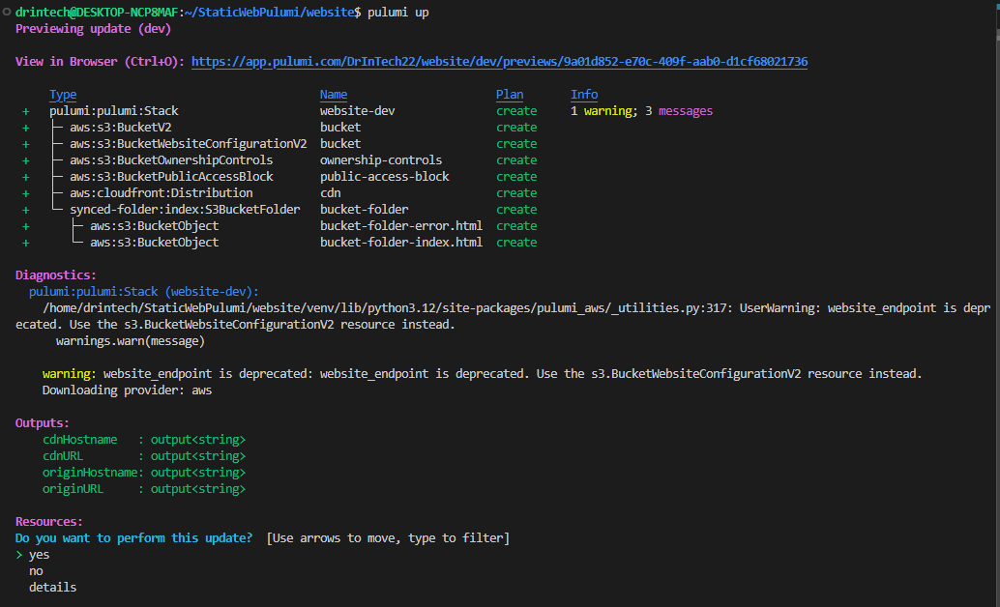

* If you select 'yes', Pulumi deploys the infrastructure. You can track the deployed stack on the Pulumi console. The console offers an easy-to-use dashboard where you can monitor deployments, view logs (updates), and see the resources deployed to a stack.
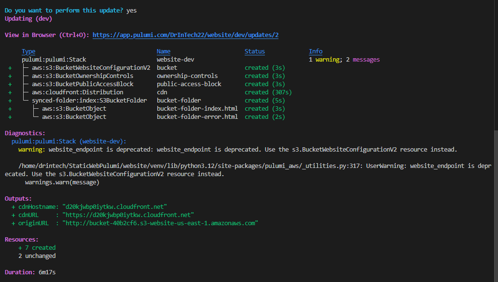 
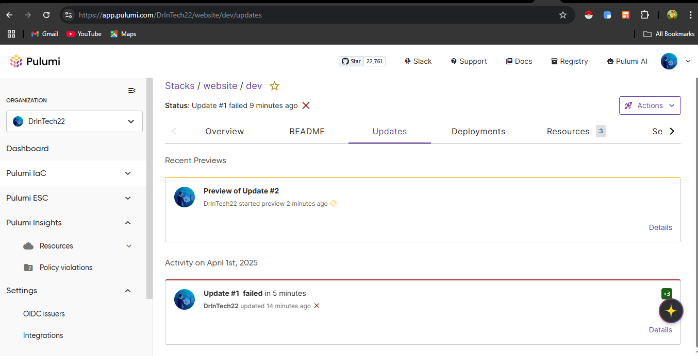 

* The CloudFront distribution will take the longest time to create. Once the deployment is complete, you will be able to access the sample static website over HTTP using the S3 `originURL` and over HTTPS using the CloudFront `cdnURL`.
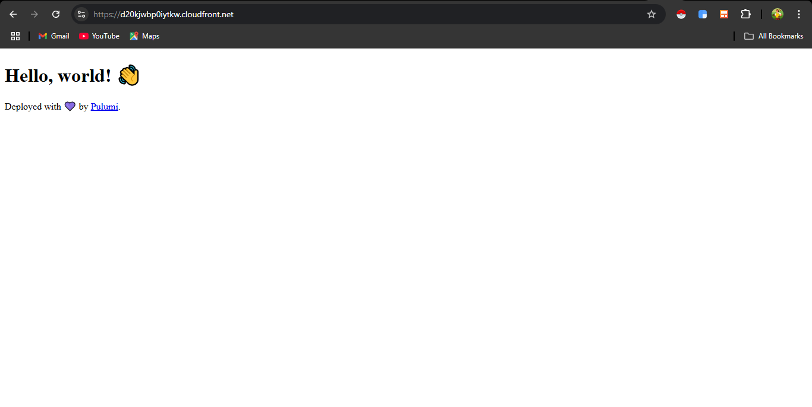 

* You can view the error page by adding a nonexistent path to the URL, for example, `https://cloudfronturl.net/nonexistent-page`.


During deployment, Pulumi might show a warning: "website\_endpoint deprecated." The `website_endpoint` is an output property that is no longer recommended. Pulumi AI, available on the console, can help fix issues like this. To resolve it, replace the `website_endpoint` property with `bucket_regional_domain_name` in the CDN configuration and export section at the bottom of the code. Run `pulumi preview` to check that the warning is resolved.

To deploy your custom website to S3, update the path in the stack file (`pulumi.dev.yaml`) to point to the location of your static website files.

Let's deploy a static React application to our S3 bucket. The `react_website/` folder is located in the root of this repository. The production build, which contains our static files, is in the `react_website/build/` directory. Update the configuration in the dev stack to deploy this React application.

```yml
config:
  aws:region: us-east-1
  website:indexDocument: index.html
  website:errorDocument: error.html
  website:path: ./react_website/build
```

* Run `pulumi up` again to deploy the React application. Access the newly deployed static website using any of the provided URL links. Test the error page by entering a non-existent path.
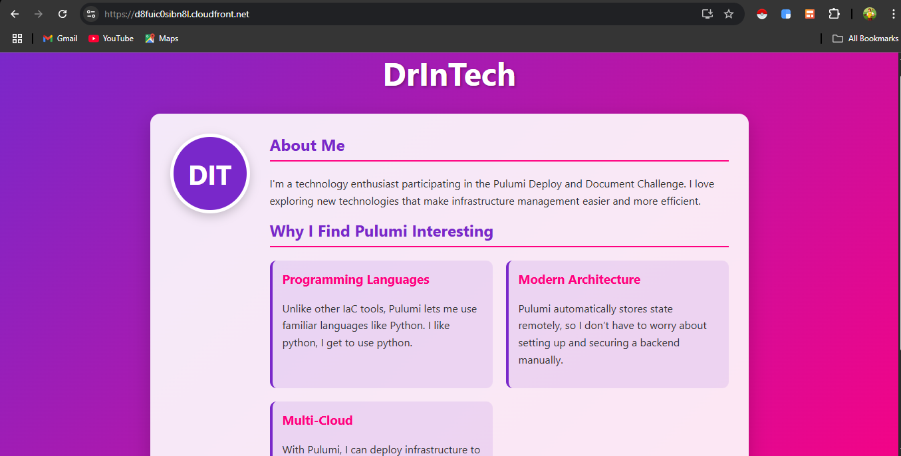     

## Secure the website deployment
Currently, the website can be accessed via HTTP using the bucket endpoint and via HTTPS using the cdnURL. Disabling `BucketPublicAccessBlock` makes the bucket and its objects publicly accessible to anyone, which poses a security risk. You will set up a secure deployment by ensuring that users can only access the static website securely through the CloudFront URL.

* Modify the `public_access_block` settings to block all public access to the S3 bucket. This ensures that no one can access the S3 bucket or read the objects unless explicitly permitted. In other words, our bucket is now private.
    

```py
public_access_block = aws.s3.BucketPublicAccessBlock(
    "public-access-block",
    bucket=bucket.bucket,
    block_public_acls=True,
    block_public_policy=True,
    ignore_public_acls=True,
    restrict_public_buckets=True,
)
```

* Next, set `object_ownership` to `BucketOwnerEnforced`. This setting disables ACLs and ensures the bucket owner is the owner of all objects. With this configuration, access to the objects can only be explicitly granted using bucket policies.
    

```py
ownership_controls = aws.s3.BucketOwnershipControls(
    "ownership-controls",
    bucket=bucket.bucket,
    rule={
        "object_ownership": "BucketOwnerEnforced",
    },
)
```

* When you run `pulumi up`, you will encounter an '**AccessControlListNotSupported: The bucket does not allow ACLs**' error for all the objects. The `synced_folder` module attaches ACLs to objects and uploads them to the S3 bucket. However, the `BucketOwnerEnforced` setting disables ACLs, which conflicts with `synced_folder`. You will need to manually write the code to upload objects to the S3 bucket using the `bucketObject` class from the S3 submodule. Replace the `synced_folder` code with the code below.
    

```py
for root, _, files in os.walk(path):
    for file in files:
        file_path = os.path.join(root, file)
        key = os.path.relpath(file_path, path)
        content_type, _ = mimetypes.guess_type(file_path)
        print(f"Uploading: {file_path} as {key}")

        aws.s3.BucketObject(
            key,
            bucket=bucket.bucket,
            source=pulumi.FileAsset(file_path),
            content_type=content_type or "application/octet-stream",
            opts=pulumi.ResourceOptions(depends_on=[ownership_controls, public_access_block]),
        )
```

This code loops through each static file in the `path`, identifies the file paths to maintain the folder structure, sets the correct file type using `mimetypes`, and uploads the files to the S3 bucket.

* At the top of the code, import `os` and `mimetypes`. These modules are needed by the code above to determine file paths and file types.
    

```py
import os
import mimetypes
```

Run `pulumi destroy && pulumi up`. Then try to access the static website using either the CloudFront URL or the S3 origin URL. You will see an access denied page. This indicates that our S3 bucket and website contents are secure. Next, you'll configure the website to be securely accessible only through CloudFront.

* Create a CloudFront Origin Access Identity (OAI). An OAI is a virtual identity that can be associated with a CloudFront distribution to secure access to private S3 bucket. Add this line above the cdn configuration.
    

```py
oai = aws.cloudfront.OriginAccessIdentity("oai")
```

* Attach the OAI to the CloudFront distribution by switching from `custom_origin_config` to `s3_origin_config`. The `s3_origin_config` sets up CloudFront to access the S3 bucket through the OAI.
    

```py
cdn = aws.cloudfront.Distribution(
    ...
    origins=[
        {
            "origin_id": bucket.arn,
            "domain_name": bucket.bucket_regional_domain_name,
            "s3_origin_config": {
                "origin_access_identity": oai.cloudfront_access_identity_path,
            },
        }
    ],
    ...
)
```

* Create an S3 bucket policy that allows only the CloudFront OAI to access the S3 bucket. The policy grants limited permission, allowing CloudFront to only fetch objects from the bucket. The code below creates the policy and attaches it to the bucket. Add it below the OAI configuration.
    

```py
bucket_policy = aws.s3.BucketPolicy(
    "bucketPolicy",
    bucket=bucket.id,
    policy=pulumi.Output.all(bucket.arn, oai.iam_arn).apply(lambda args: f"""{{
        "Version": "2012-10-17",
        "Statement": [
            {{
                "Effect": "Allow",
                "Principal": {{"AWS": "{args[1]}"}},
                "Action": "s3:GetObject",
                "Resource": "{args[0]}/*"
            }}
        ]
    }}""")
)
```

Now, run `pulumi up`. After a successful deployment, try accessing the static website using the CloudFront URL link. You might still encounter an access denied error. When you configure OAI for CloudFront distribution, some optional settings become necessary. Initially, we didn't set the `index.html` to be served to users when they use the CloudFront URL. However, CloudFront now requires us to explicitly set the entry point for the static website.
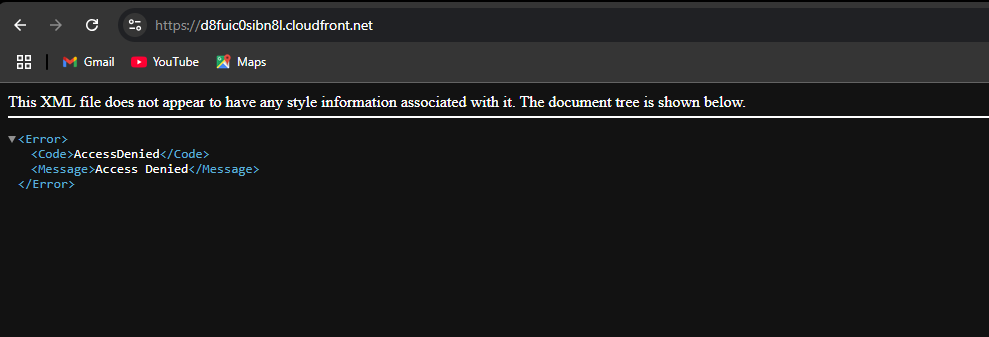    

* Set the default root object in the CloudFront configuration.
    

```py
cdn = aws.cloudfront.Distribution(
    "cdn",
    enabled=True,
    default_root_object="index.html",
    origins=[
       ...
    ],
    ...
)
```

* Now, run `pulumi up`. Once it's done, you should be able to securely access your static website using the CloudFront URL. If you try the origin URL, it will return an access denied error, which is expected. However, if you try to access the error page using the CloudFront URL, you will also get an access denied error, which is unexpected.
    

After configuring OAI, the S3 bucket returns a 403 error code to CloudFront for non-existent pages instead of a 404. You need to set up CloudFront to display the error page and send a 404 error response code to users when it gets a 403 error code from the S3 bucket.

```py
...
custom_error_responses=[
    {
        "error_code": 403,
        "response_code": 404,
        "response_page_path": f"/{error_document}",
    }
]
...
```

* Run `pulumi up`. You should now be able to securely access both the error page and the main website page using the CloudFront URL. If you try to access the page using the origin URL, you'll get an access denied error. This indicates that our static website is secure and can only be accessed through CloudFront..
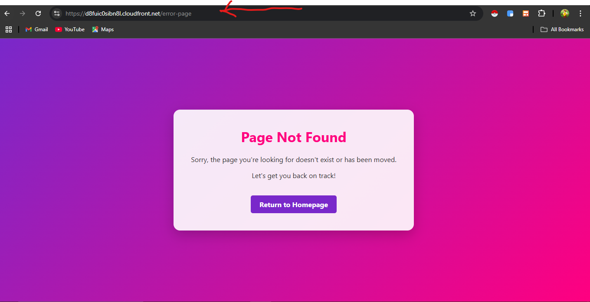    

## Setup a Custom Domain

Sharing CloudFront URL to your users, friends, families or customers is boring and doesn't look too good. You'll set up a custom domain using AWS Route 53 and provision an SSL certificate for the domain with AWS Certificate Manager (ACM).

The custom domain used in this guide is purchased from Namecheap but delegated to a Route 53 hosted zone. This setup allows you to manage the domain, such as creating subdomains and records, in Route 53 without transferring ownership to AWS.

* Add the domain and sub domain config to the stack. This will reflect in `pulumi.dev.yaml`.
    

```yml
pulumi config set domain drintech.online
pulumi config set subdomain challenge
```

* Next, import the new configurations into your code.
    

```py
domain = config.require("domain");
subdomain = config.require("subdomain");
domain_name = f"{subdomain}.{domain}";
```

* Create and validate a new SSL/TLS certificate with ACM. Add these lines above the cdn code.
    

```py
# Look up your existing Route 53 hosted zone.
zone = aws.route53.get_zone_output(name=domain)

# Provision a new ACM certificate.
certificate = aws.acm.Certificate(
    "certificate",
    domain_name=domain_name,
    validation_method="DNS",
    opts=pulumi.ResourceOptions(
        # ACM certificates must be created in the us-east-1 region.
        provider=aws.Provider("us-east-provider", region="us-east-1"),
    ),
);

# Validate the ACM certificate with DNS.
options = certificate.domain_validation_options.apply(lambda options: options[0])
certificate_validation = aws.route53.Record(
    "certificate-validation",
    name=options.resource_record_name,
    type=options.resource_record_type,
    records=[options.resource_record_value],
    zone_id=zone.zone_id,
    ttl=60,
);
```

This provisions an ACM certificate for the sub domain in `us-east-1` and validates it using the DNS validation method. This method requires creating a DNS record in the hosted zone to confirm domain ownership.

* Adjust the CloudFront code to handle requests for the custom domain by using the `aliases` argument. The CloudFront default certificate is only valid for CloudFront’s default domain, so you’ll replace it with the newly configured ACM certificate.
    

```py
 cdn = aws.cloudfront.Distribution(
    # ...
    aliases=[
        domain_name,
    ],
    viewer_certificate=aws.cloudfront.DistributionViewerCertificateArgs(
        cloudfront_default_certificate=False,
        acm_certificate_arn=certificate.arn,
        ssl_support_method="sni-only",
    ),
)
```

* Below the CloudFront configuration, create a route53 alias A record that maps our subdomain to the CloudFront domain.
    

```py
my_site = aws.route53.Record(domain_name,
    zone_id=zone.zone_id,
    name=subdomain,
    type="A",
    aliases=[
        aws.route53.RecordAliasArgs(
            name=cdn.domain_name,
            zone_id=cdn.hosted_zone_id,
            evaluate_target_health=True,
        )
    ],
    opts=pulumi.ResourceOptions(
        depends_on=certificate,
    ),
)
```

You might be wondering why we use an alias A record instead of a CNAME record, which is commonly used for mapping one domain to another. The Route 53 alias A record is recommended for mapping domains to AWS services like CloudFront. With an alias A record, DNS queries are resolved internally, making them more efficient.

* The final step is to export the new domain URL as an output.
    

```py
pulumi.export("domainURL", f"https://{domain_name}")
```

You can now run `pulumi up` and securely access the static website using the custom domain URL. Add a non-existent path to the URL to see the error response page.
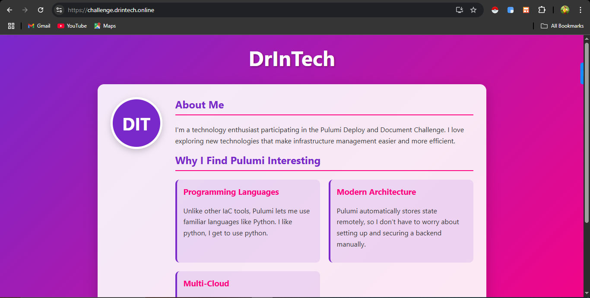 

## Best Practices
1. **Use Origin Access Identity (OAI)**: Restrict S3 access to CloudFront only via OAI.

2. **Block All Public Access**: Disable public access on the bucket using `BucketPublicAccessBlock`.

3. **Follow Least Privilege Principle**: Grant only the minimum required permissions in bucket policies and IAM roles.

4. **Use HTTPS with ACM Certificate**: Redirect HTTP to HTTPS and attach an ACM cert for secure delivery.

5. **Configure Custom Error Pages**: Serve friendly 404 pages via CloudFront’s custom_error_responses.

6. **Use Route 53 Alias A Record**: Use alias A records instead of CNAMEs to point domains to CloudFront.